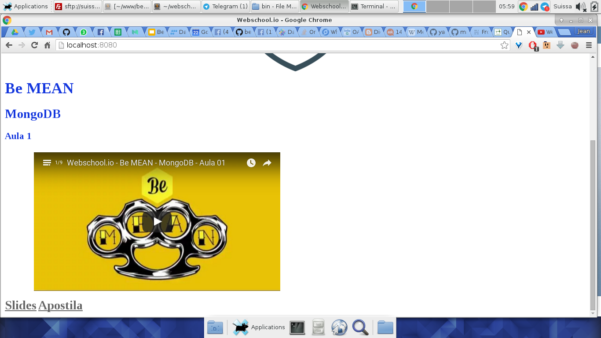
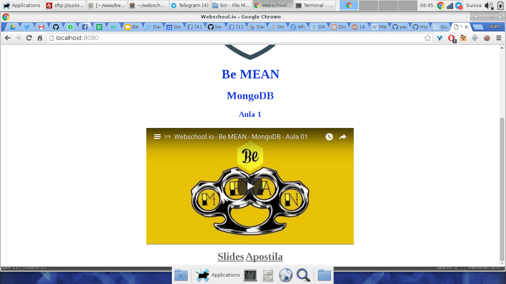
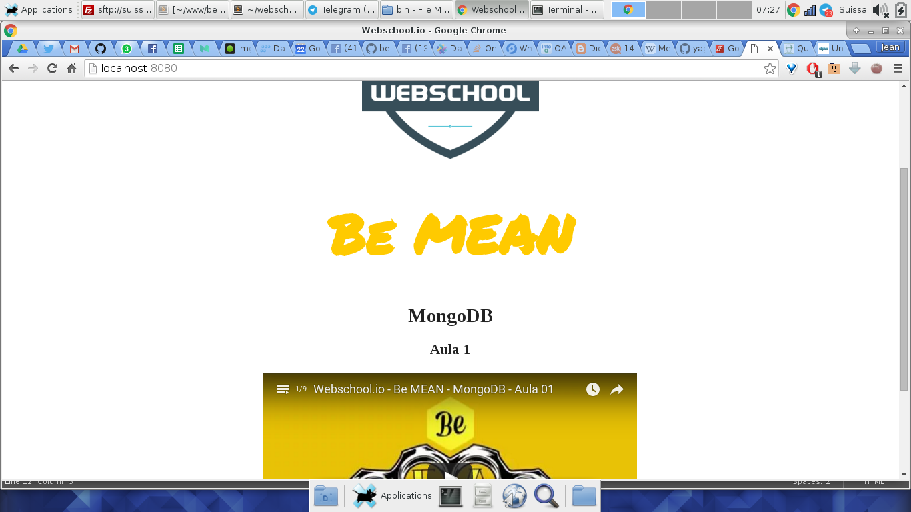

# Webschool.io Site

Iremos desenvolver uma página simples apenas para mostrar os vídeos do [Be MEAN](), para isso usaremos o Atomic Design para criar os componentes visuais.

Caso você não tenha lido nada, ainda, sobre Atomic Design saiba que ele é uma metolodologia para criação de componentes visuais para sistemas web, é dividido em 5 etapas:

- Átomos
- Moléculas
- Organismos
- Templates
- Pages

As 3 primeiras são as etapas de estilização, então vamos iniciar nossa jornada no mundo da química

## Átomos

- logo
- titulo-curso
- titulo-modulo
- titulo-aula
- video
- slides
- apostila

## Moléculas

- aula
  + titulo-aula
  + video
  + slides
  + apostila
- modulo
  + titulo-modulo
  + aulas

## Organismos

- cursos
  + titulo-curso
  + modulos

## Estilizando

Primeiramente devemos estilizar os átomos como sendo a base de tudo, para isso vamos definir regras bem simples para que sigam um padrão de cores e tamanhos e principalmente sua **responsividade**.

```css
.atom-logo {
  display: block;
  width: 20%;
  max-width: 30%;
  margin: 0 auto;
}
.atom-titulo-curso {
  color: #1437DE;
  font-size: 2.2rem;
}
.atom-titulo-modulo {
  color: #1437DE;
  font-size: 1.8rem;
}
.atom-titulo-aula {
  color: #1437DE;
  font-size: 1.4rem;
}
.atom-video {
  display: block;
  margin: 1em auto;
  width: 90%;
}
.atom-slides {
  color: #666;
  font-size: 1.8rem;
  font-weight: bold;
  text-decoration: underline;
}
.atom-apostila {
  color: #666;
  font-size: 1.8rem;
  font-weight: bold;
  text-decoration: underline;
}
```

Depois de definido os átomos vamos criar a estrutura do HTML pois dessa forma fica mais fácil visualizar os componentes do que apenas no CSS.

```html


<main class="organism-cursos">
  <h1 class="atom-titulo-curso">Be MEAN</h1>
</main>
```

O código acima é o nível mais alto da nossa hierarquia, logo você deve se perguntar:

> Ué mas átomo no mesmo nível do organismo?

**Exatamente!** Porque no Atomic Design o átomo é a menor parte **independente** dos componentes, logo a `img` com o `atom-logo` pode estar em qualquer sozinho, porém para agrupar mais átomos precisamos criar uma molécula:


```html


<main class="organism-cursos">
  <h1 class="atom-titulo-curso">Be MEAN</h1>

  <section class="molecule-modulos">
    <h2 class="atom-titulo-modulo">MongoDB</h2>
    
  </section>
</main>
```

Percebeu que os títulos, nesse layout, são todos átomos pois não os agrupamos com `hgroup`. 

Entrando um pouco mais na nossa química dos estilos iremos criar uma reação entre 2 moléculas:


```html


<main class="organism-cursos">
  <h1 class="atom-titulo-curso">Be MEAN</h1>

  <section class="molecule-modulos">
    <h2 class="atom-titulo-modulo">MongoDB</h2>
    
    <article class="molecule-aula">
      <h3 class="atom-titulo-aula">Aula 1</h3>
      
    </article>

  </section>
</main>
```

**Percebeu que colocamos 1 molécula dentro de outra?**

```html
<section class="molecule-modulos">
  <h2 class="atom-titulo-modulo">MongoDB</h2>
  
  <article class="molecule-aula">
    <h3 class="atom-titulo-aula">Aula 1</h3>

  </article>
</section>
```

Pense como sendo uma reação química de absorção.

> Absorção na química é um fenômeno ou processo físico ou químico em que átomos, moléculas ou íons introduzem-se em alguma outra fase, normalmente mais massiva, e fixam-se. O processo pode se dar pela fixação de um gás por um sólido ou um líquido, ou a fixação de um líquido por um sólido.
A substância absorvida se infiltra na substância que absorve, diferentemente da adsorção, já que espécies químicas submetidas a absorção são absorvidas pelo volume, não pela superfície (como no caso de adsorção). 

*fonte: [https://pt.wikipedia.org/wiki/Absor%C3%A7%C3%A3o_(qu%C3%ADmica)](https://pt.wikipedia.org/wiki/Absor%C3%A7%C3%A3o_(qu%C3%ADmica))*

Nesse caso a molécula absorvida foi `molecule-aula`, agora finalizamos com seus átomos internos já que essa é nossa menor molécula:


```html
<article class="molecule-aula">
  <h3 class="atom-titulo-aula">Aula 1</h3>
  
  <div class="atom-video">
    <iframe width="560" height="315" src="https://www.youtube.com/embed/leYxsEAL_yY?list=PL77JVjKTJT2gXHb9FEokJsPEcoOmyF1pY" frameborder="0" allowfullscreen></iframe>
  </div>

  <div>
    <a class="atom-slides" href="https://docs.google.com/presentation/d/1_CHh_fTkzgxAnxB3MlZ5WRhTqMLViMk__jkCZiZ3IMA/edit?usp=sharing">Slides</a>
    <a class="atom-apostila" href="https://github.com/Webschool-io/be-mean-instagram">Apostila</a>
  </div>
</article>
```

Deixando nosso HTML assim:

```html
<!DOCTYPE html>
<html lang="en">
<head>
  <meta charset="UTF-8">
  <meta http-equiv="Content-Type" content="text/html; charset=UTF-8" />
  <meta name="viewport" content="width=device-width, initial-scale=1">
  <link rel="stylesheet" href="./assets/css/style.css">
  <title>Webschool.io</title>
</head>
<body>
  

  <main class="organism-cursos">
    <h1 class="atom-titulo-curso">Be MEAN</h1>

    <section class="molecule-modulos">
      <h2 class="atom-titulo-modulo">MongoDB</h2>
      
      <article class="molecule-aula">
        <h3 class="atom-titulo-aula">Aula 1</h3>
        
        <div class="atom-video">
          <iframe width="560" height="315" src="https://www.youtube.com/embed/leYxsEAL_yY?list=PL77JVjKTJT2gXHb9FEokJsPEcoOmyF1pY" frameborder="0" allowfullscreen></iframe>
        </div>

        <div>
          <a class="atom-slides" href="https://docs.google.com/presentation/d/1_CHh_fTkzgxAnxB3MlZ5WRhTqMLViMk__jkCZiZ3IMA/edit?usp=sharing">Slides</a>
          <a class="atom-apostila" href="https://github.com/Webschool-io/be-mean-instagram">Apostila</a>
        </div>
      </article>

    </section>
  </main>
</body>
</html>
```



Após essas 3 etapas (Átomo, Molécula e Organismo) iremos definir o Template, essa é a etapa onde posicionamos nossos elementos.

Vamos iniciar centralizando o conteúdo principal, o logo já foi previamente centralizado no padrão do seu átomo.

```css
.organism-cursos {
  text-align: center;
  margin: 0 auto;
}
```



Agora vamos dar os retoques finais como *font*, *margins* e afins.

Adicionei a *font* [Permanent Marker](https://fonts.googleapis.com/css?family=Permanent+Marker) e mudei a cor do título do curso para amarelo, e os outros títulos para preto, porém não podemos mais modificar os átomos.



**Então como devemos fazer?**

Você conhece algo chamado [Precedência de seletores](http://intentor.com.br/precedencia-de-seletores-css/)?

Basicamente é um conjunto de regras que definem o **peso** de seletores css, para aplicar essas regras iremos utilizar o Cálculo de precedência que separa os seletores em 3 categorias:

- x: quantidade de seletores do tipo id existentes na regra CSS;
- y: quantidade de seletores do tipo classe ou pseudoclasse;
- z: quantidade de seletores do tipo HTML;

Onde a fórmula para calcular o peso é:

``` 
(x,y,z)

x > y > z
```

Vamos entender com o nosso exemplo:


``` css
.atom-titulo-curso {
  font-family: 'Permanent Marker', cursive;
  font-size: 5rem;
}
``` 

``` 
(0,1,0)
```

``` css
.organism-cursos .atom-titulo-curso {
  color: #FFCA00;
}
``` 

(0,2,0)


Ou seja eu aumento o valor do seletor `.organism-cursos .atom-titulo-curso` por utilizar 2 classes, claraamente você percebe que qualquer seletor com ID(#) terá precêdencia sobre todos.

Agora siga meu pensamento:

> O seletor com ID tem maior peso, logo seu estilo sempre será o último a ser lido.

Isso não te lembra uma outra funcionalidade do CSS? Algo bem importante??

Agora ficou fácil né!!!

Sim. O `!important`.

Então reguarde seus IDs para estilos que precisem se sobrepor ao padrões definidos anteriormente.

Sabendo disso entendemos como modificar o átomo apenas quando o mesmo se encontra em uma molécula, possibilitando assim que os átomos nunca sejam modificados diretamente. 

Isso me lembrou do [Princípio da incerteza de Heisenberg](https://pt.wikipedia.org/wiki/Princ%C3%ADpio_da_incerteza_de_Heisenberg), porém ele é para elétrons.

Agora vamos ver o porquê essa forma faz sentido e é facilmente reusável.

Hora de adicionr mais um curso na Webschool.io, vamos pegar a primeira aula do [Cue]()